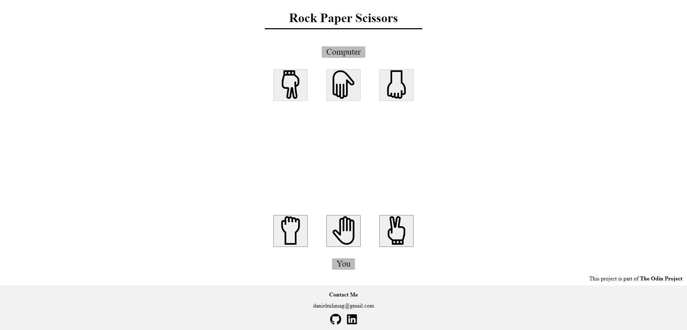

# Rock Paper Scissors

## Introduction

This is a Web version of the famous game Rock Paper Scissors,  
built with plain HTML, CSS and Javascript and is part of [The Odin Project](https://www.theodinproject.com/).

## Introduction
MyBooks consists on a webpage library that allows the user to input and store book's info.   
This project was built with plain HTML, CSS and Javascript and it is part of [The Odin Project's curriculum](https://www.theodinproject.com/).

## Screenshot

## Visualize WebPage

This project is hosted in my GitHub Pages and you can access it [in here](https://daniellima0.github.io/rock-paper-scissors/).
